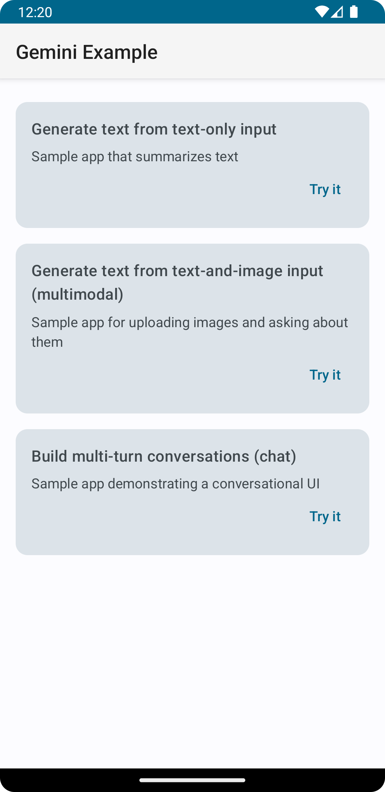
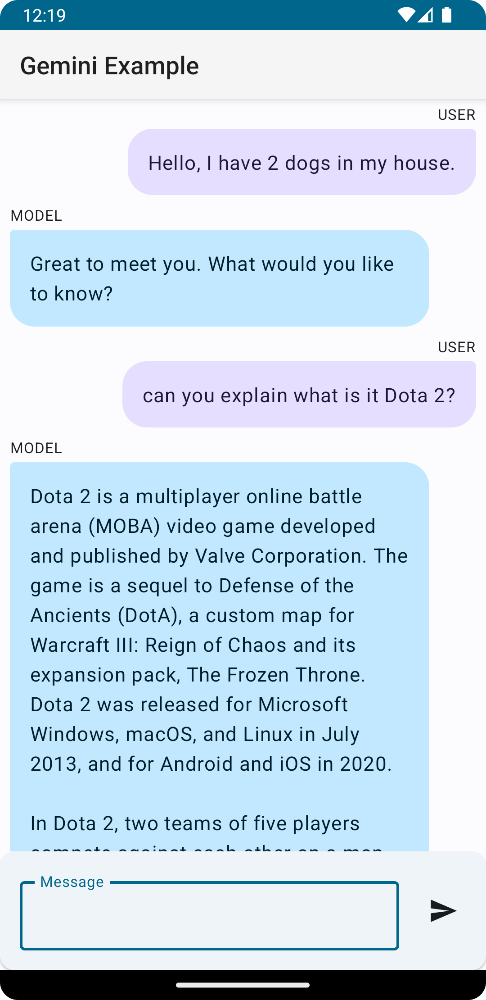

# Gemini Example

This quickstart demonstrates how to access the Gemini API directly from your Android app using the
Google AI client SDK for Android.
The Gemini API gives you access to the latest generative AI models from Google.

## Pre-requisites

Get an API key from
the [Google AI for Developers](https://ai.google.dev/tutorials/workspace_auth_quickstart).
Later, add your API key to the `local.properties` file in the root of the project:

```
apiKey="xxxxxxxx-xxxx-xxxx-xxxx-xxxxxxxxxxxx"
```

## Libraries

- Hilt
- Retrofit
- Jetpack Compose
- Hilt Navigation Compose
- Generative AI

## Architecture

- MVVM
- Clean Architecture

## Screenshots




## Author

Yanay Hollander
